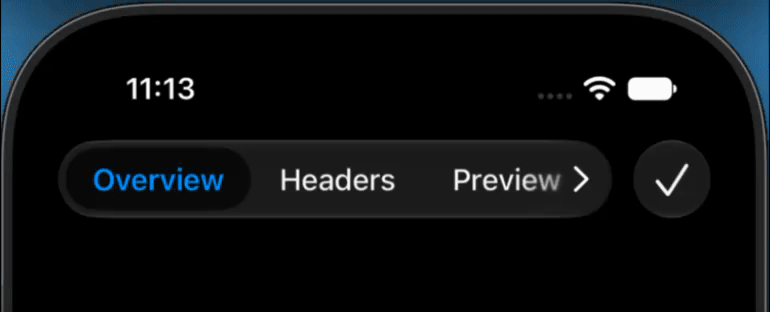

# ScrollableTabBar

`ScrollableTabBar` is an iOS UIKit control for presenting an ordered selection
whose overflow items remain horizontally reachable.



> [!WARNING]
> The preferred floating presentation relies on undocumented UIKit APIs and
> runtime behavior. Its availability, exact Liquid Glass appearance, and App
> Store acceptance are not guaranteed.

## Requirements

- iOS 18.0+
- Swift 6.3+
- UIKit

## Ownership

The app owns:

- each item's domain identity and meaning;
- item membership and order;
- the application's selected value and corresponding content;
- replacement of the control when membership or order changes.

`ScrollableTabBar` owns:

- the UIKit projection of the current selection;
- delivery of user selection through `UIControl.Event.valueChanged`;
- adaptation between its preferred floating presentation and public fallback.

## Quick Start

```swift
import ScrollableTabBar
import UIKit

@MainActor
final class ReportViewController: UIViewController {
    private enum Section: Hashable {
        case overview
        case activity
        case settings
    }

    private var selectedSection: Section = .overview

    private lazy var sectionControl: ScrollableTabBar<Section> = {
        let control = ScrollableTabBar(
            items: [
                .init(
                    id: .overview,
                    title: "Overview",
                    accessibilityIdentifier: "Report.Section.Overview"
                ),
                .init(
                    id: .activity,
                    title: "Activity",
                    accessibilityIdentifier: "Report.Section.Activity"
                ),
                .init(
                    id: .settings,
                    title: "Settings",
                    image: UIImage(systemName: "gear"),
                    accessibilityIdentifier: "Report.Section.Settings"
                ),
            ],
            selectedID: selectedSection
        )
        control.accessibilityLabel = "Report Section"
        control.addTarget(
            self,
            action: #selector(sectionSelectionChanged),
            for: .valueChanged
        )
        return control
    }()

    override func viewDidLoad() {
        super.viewDidLoad()
        navigationItem.titleView = sectionControl
        showSection(selectedSection)
    }

    @objc private func sectionSelectionChanged() {
        selectedSection = sectionControl.selectedID
        showSection(selectedSection)
    }

    private func showSection(_ section: Section) {
        // Render application content for `section`.
    }
}
```

## Selection Contract

- `items` is fixed, nonempty, ordered, and contains unique IDs.
- The initial and every assigned `selectedID` belongs to `items`.
- Programmatic `selectedID` assignment updates presentation without sending
  `.valueChanged`.
- User selection updates `selectedID` before sending one `.valueChanged`.
- Reselecting the current item sends no event.
- Setting `isEnabled` to `false` prevents user selection.

See [Selection Ownership](Sources/ScrollableTabBar/ScrollableTabBar.docc/SelectionOwnership.md)
for the detailed behavior contract.

## Presentation

When its expected UIKit runtime contract is available, the control uses the
system floating-tab presentation. On verified OS versions, manual dragging is
continuous while UIKit's native page buttons remain available, and the floating
viewport follows the width assigned by its navigation container up to the
control's 640-point preferred maximum. Narrower containers keep overflow items
reachable. If that contract is unavailable or changes, the control uses a
public UIKit segmented or menu presentation while preserving selection,
ordering, enablement, and event semantics.

The number of visible items, continuous scrolling, arrow placement, pagination
width, and exact visual treatment are intentionally not API guarantees.

## Testing

Run package tests on an iOS Simulator:

```sh
xcodebuild test \
  -workspace ScrollableTabBar.xcworkspace \
  -scheme ScrollableTabBarTests \
  -destination 'platform=iOS Simulator,name=iPhone 17,OS=latest'
```

Run the external public-product contract from its separate package:

```sh
cd ContractTests
xcodebuild test \
  -scheme ScrollableTabBarProductContract-Package \
  -destination 'platform=iOS Simulator,name=iPhone 17,OS=latest'
```

The package and external product-contract suites use Swift Testing. The demo's
gesture automation uses XCUITest because launching and driving an application
is owned by the XCTest UI-testing runner.

`ScrollableTabBar.xcworkspace` is the combined developer entry point for the
package and demo app. The Swift package remains the only library source of
truth.

## Documentation

- [ScrollableTabBar DocC](Sources/ScrollableTabBar/ScrollableTabBar.docc/ScrollableTabBar.md)
- [Selection Ownership](Sources/ScrollableTabBar/ScrollableTabBar.docc/SelectionOwnership.md)

## License

ScrollableTabBar is available under the MIT License. See [LICENSE](LICENSE).
