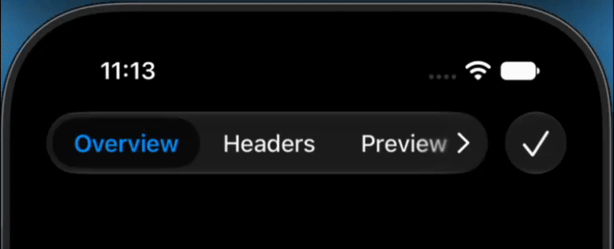

# ScrollableTabBar

`ScrollableTabBar` is an iOS UIKit control for presenting an ordered selection
whose overflow items remain horizontally reachable.



> [!WARNING]
> The preferred floating presentation relies on undocumented UIKit APIs and
> runtime behavior. Its availability, exact Liquid Glass appearance, and App
> Store acceptance are not guaranteed.

## Requirements

- iOS 18.4+
- Swift 6.3+

## State Ownership

The app remains the source of truth for each item's domain identity, membership
and order, selected value, and corresponding content. `ScrollableTabBar`
projects that selection into UIKit. Apply changes to membership, order, display
content, and selection together with `setItems(_:selectedID:)`.

See [Selection Ownership](https://lynnswap.github.io/ScrollableTabBar/documentation/scrollabletabbar/selectionownership/)
for programmatic and user-driven selection behavior.

## Quick Start

```swift
import ScrollableTabBar
import UIKit

@MainActor
final class DashboardViewController: UIViewController, ScrollableTabBarDelegate {
    enum Section: Hashable {
        case summary
        case activity
        case settings
    }

    private var selectedSection: Section = .summary

    private lazy var sectionControl: ScrollableTabBar<Section> = {
        let control = ScrollableTabBar(
            items: [
                .init(id: .summary, title: "Summary"),
                .init(id: .activity, title: "Activity"),
                .init(
                    id: .settings,
                    title: "Settings",
                    image: UIImage(systemName: "gear")
                ),
            ],
            selectedID: selectedSection
        )
        control.accessibilityLabel = "Dashboard Section"
        control.delegate = self
        return control
    }()

    override func viewDidLoad() {
        super.viewDidLoad()
        navigationItem.titleView = sectionControl
        showSection(selectedSection)
    }

    func scrollableTabBar(
        _ tabBar: ScrollableTabBar<Section>,
        didSelect selectedID: Section
    ) {
        selectedSection = selectedID
        showSection(selectedID)
    }

    private func showSection(_ section: Section) {
        // Render application content for `section`.
    }
}
```

## Updating Tabs

Pass the application's updated items and selection to the same control:

```swift
var items: [ScrollableTabBar<String>.Item] = [
    .init(id: "inbox", title: "Inbox"),
    .init(id: "archive", title: "Archive"),
]
let tabBar = ScrollableTabBar(items: items, selectedID: "inbox")

items.append(.init(id: "drafts", title: "Drafts"))
tabBar.setItems(items, selectedID: "drafts")

items.removeAll { $0.id == "drafts" }
tabBar.setItems(items, selectedID: "inbox")

tabBar.setItems([], selectedID: nil)
```

Item IDs must be unique. A non-`nil` selection must belong to the supplied
items; `nil` means no selection. Programmatic updates do not call the delegate.
`ScrollableTabBar<ID>()` creates an empty control that can be populated later.

`selectedID` is now optional. When migrating existing code that reads it,
handle the absence of a selection before rendering the selected content.

## Presentation

When its expected UIKit runtime contract is available, the control uses the
system floating-tab presentation. Otherwise, a public UIKit fallback preserves
selection, ordering, enablement, and event semantics. Exact layout and
appearance are not API guarantees.

## Testing

Run package tests on an iOS Simulator:

```sh
xcodebuild test \
  -workspace ScrollableTabBar.xcworkspace \
  -scheme ScrollableTabBarTests \
  -destination 'platform=iOS Simulator,name=iPhone 17,OS=latest'
```

Run the external public-product contract from its separate package:

```sh
cd ContractTests
xcodebuild test \
  -scheme ScrollableTabBarProductContract-Package \
  -destination 'platform=iOS Simulator,name=iPhone 17,OS=latest'
```

## Documentation

- [ScrollableTabBar Documentation](https://lynnswap.github.io/ScrollableTabBar/documentation/scrollabletabbar/)

## License

ScrollableTabBar is available under the MIT License. See [LICENSE](LICENSE).
